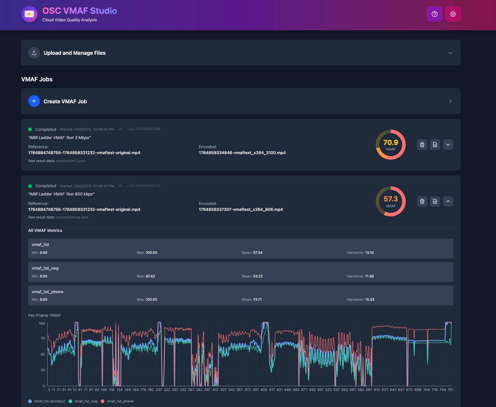

# OSC VMAF Studio

A cloud-based VMAF (Video Multimethod Assessment Fusion) analysis tool powered by OSC (Open Source Cloud) and Eyevinn EasyVMAF. Supports AWS S3 and S3-compatible storage for video quality assessment.

## Features

- **Multi-Bucket Support**: Manage multiple S3 buckets for organizing video files and analysis results
- **Video File Management**: Upload, browse, and organize video files in S3 storage with folder support
- **VMAF Analysis**: Run VMAF quality assessments comparing reference and distorted videos
- **Results Visualization**:
  - Interactive charts showing VMAF scores across video frames
  - Multiple VMAF metric support (vmaf, vmaf_hd, vmaf_4k, etc.)
  - Frame-by-frame score viewing
  - Download raw results in JSON format
- **Job Management**: Track analysis jobs with detailed status and metadata
- **Secure Configuration**: S3 credentials stored securely on the backend only

<a href="OSC_VMAF_Studio_Screenshot.png">
  
</a>

## Architecture

### Frontend

- **React** with TypeScript and Vite
- **Recharts** for data visualization
- **Tailwind CSS** for styling

### Backend

- **Node.js** with Express
- **AWS SDK** for S3-compatible storage
- **Eyevinn OSaaS SDK** for VMAF processing

## Prerequisites

- Node.js (v16 or higher)
- npm or yarn
- S3-compatible storage (AWS S3, OCI Object Storage, MinIO, etc.)
- Eyevinn OSaaS account with access to VMAF analysis services

## Installation

1. Clone the repository:

```bash
git clone <repository-url>
cd osc-vmaf-studio
```

2. Install dependencies:

```bash
npm install
```

## Configuration

### First-Time Setup

1. Start the development server:

```bash
npm run dev
```

2. Open your browser to `http://localhost:5173`

3. Click the settings icon (⚙️) to configure:

#### S3 Configuration

Choose your storage type:

**For AWS S3:**

- **Storage Type**: Select "AWS S3"
- **S3 Bucket**: Your S3 bucket name (e.g., `my-bucket-name`)
- **Region**: Your AWS region (e.g., `us-east-1`, `eu-west-1`)
- **Access Key**: Your AWS access key ID
- **Secret Key**: Your AWS secret access key

**For S3-Compatible Storage (MinIO, OCI, etc.):**

- **Storage Type**: Select "S3-Compatible"
- **Endpoint**: Your S3-compatible endpoint (e.g., `https://your-minio.osaas.io`)
- **Access Key**: Your S3 access key ID
- **Secret Key**: Your S3 secret access key

#### OSC (Open Source Cloud) Configuration

- **OSC Token**: Your OSC Personal Access Token for authentication with Eyevinn services

4. Click "Save Configuration" to store settings securely on the backend

### Configuration Storage

All credentials are stored **only in the backend server memory** and are never persisted to disk or sent to the browser. Configuration can be initialized from environment variables for production deployments.

## Usage

### Managing Buckets

1. **Select Bucket**: Use the bucket dropdown in the header to switch between buckets
2. **Create Bucket**: Click the "+" button next to the bucket selector to create a new bucket

### Uploading Videos (Not for AWS S3 storage)

1. Navigate to the bucket where you want to store videos
2. Optionally navigate into a folder or create a new one
3. Click the "Upload Files" button
4. Select one or more video files
5. Files are uploaded directly to S3 and appear in the file list

### Running VMAF Analysis

1. Click "Create VMAF Job" button
2. Select a **reference video** (the original/source video) by clicking "Ref" next to the file name
3. Select a **distorted video** (the encoded/compressed version) by clicking "Enc" next to the file name
4. Add an optional description for the job
5. Click "Start Analysis"

The job will appear in the jobs list with status updates:

- **Queued**: Job is waiting to start
- **Running**: Analysis in progress
- **Completed**: Analysis finished successfully
- **Failed**: Analysis encountered an error

### Viewing Results

1. When a job is completed, click the expand chevron (▼) to view results
2. The results include:
   - Overall VMAF score
   - Interactive chart showing per-frame scores
   - Metric statistics (mean, min, max, harmonic mean)
   - Frame-by-frame data
3. Click "Download Raw Results" to save the complete JSON data

### Managing Jobs

- **Delete Job**: Click the trash icon on a job card to delete the job and its results
- **View Details**: Expand completed jobs to see full VMAF metrics and charts
- **Job History**: Jobs are persisted in S3 and reload when you switch buckets

## Development

### Project Structure

```
osc-vmaf-studio/
├── src/                    # Frontend React application
│   ├── components/         # React components
│   │   ├── FileList.tsx   # File browser component
│   │   ├── FileUpload.tsx # File upload component
│   │   ├── JobCreator.tsx # VMAF job creation
│   │   ├── ResultsViewer.tsx # Results visualization
│   │   ├── VmafScoreCircle.tsx # VMAF score visualization
│   │   ├── Settings.tsx   # Configuration UI
│   │   └── Help.tsx       # Help documentation
│   ├── App.tsx            # Main application component
│   └── main.tsx           # Application entry point
├── server/                # Backend Express server
│   └── index.ts          # Server entry point & API
└── README.md
```

### Running in Development

```bash
npm run dev
```

This starts both the frontend (port 5173) and backend (port 3001) in development mode with hot reload.

### Building for Production

```bash
npm run build
```

The frontend is built to the `dist/` directory.

### Running Tests

```bash
npm test
```

## API Endpoints

### Configuration

- `GET /api/config` - Get configuration status (credentials excluded)
- `POST /api/config` - Save configuration (backend only)

### Buckets

- `GET /api/buckets` - List all buckets
- `POST /api/buckets` - Create a new bucket

### Files

- `GET /api/files?bucket=<name>` - List files in a bucket
- `POST /api/upload-url` - Get presigned URL for file upload
- `DELETE /api/files/:key` - Delete a file
- `DELETE /api/folders/:key` - Delete a folder and contents

### Jobs

- `GET /api/jobs?bucket=<name>` - List all jobs in a bucket
- `POST /api/jobs` - Create a new VMAF analysis job
- `GET /api/jobs/:jobId/status` - Get job status
- `DELETE /api/jobs/:jobId?bucket=<name>` - Delete a job and its results

### Results

- `GET /api/results/:jobId?bucket=<name>` - Get parsed VMAF results
- `GET /api/results/:jobId/raw?bucket=<name>` - Download raw JSON results

## Troubleshooting

### Configuration Not Working

- Ensure your OSC Personal Access Token is valid
- Verify S3 endpoint URL format (should include `https://` for S3-Compatible storage)
- Verify S3 credentials have required permissions (read/write access to buckets)

### Jobs Not Starting

- Check that your OSC token is valid and has access to EasyVMAF service
- Ensure both reference and distorted videos are in valid formats
- Verify OSC/EasyVMAF service has access to your S3 bucket

### Results Not Loading

- Jobs must complete successfully before results are available
- Check browser console for errors
- Verify the job's bucket still exists and you have access

### Files Not Appearing

- Ensure you're viewing the correct bucket
- Check S3 permissions for listing objects
- Refresh the page to reload the file list

## Security Notes

- Credentials are stored only in backend server memory
- Consider implementing authentication for production use
- Restrict S3 bucket access with appropriate IAM policies
- Never expose credentials in client-side code

## License

MIT

## Contributing

Contributions are welcome! Please open an issue or submit a pull request.
